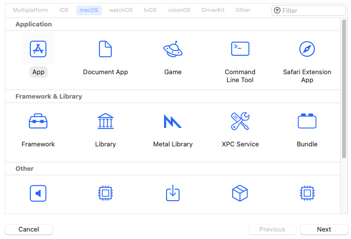
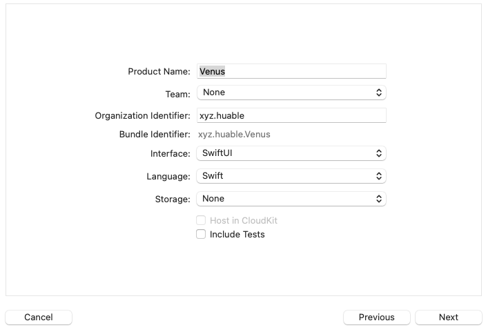
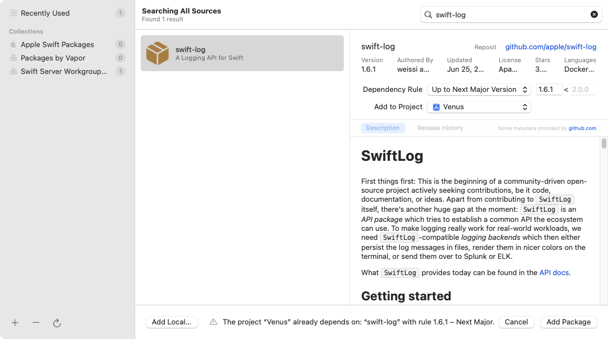
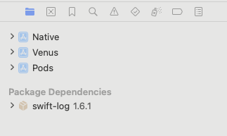
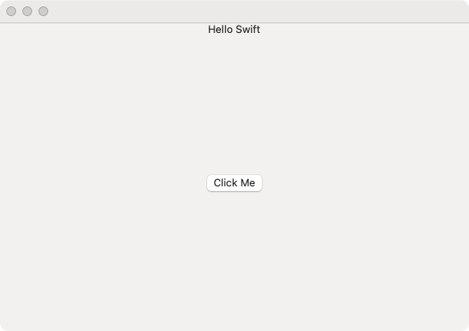

在Swift 5.9版本更新中，官方引入了C++互操作性功能，使得Swift可以直接调用C++代码。这对于那些需要在Swift中使用C++库的开发者来说是一个重大的利好。

关于Swift和C++互操作性的详细信息，可以参考官方文档：[Mixing Swift and C++](https://www.swift.org/documentation/cxx-interop/)。

官方文档中较多提及了Swift和C++两种语言的互操作特性，如何在编译器层面，提供两种语言的互操作支持。包括类型映射，语法特性兼容性等。

但如果要应用到实际项目中，至少还有一些实践方面的问题需要考虑。比如如何构建和处理第三方库依赖等。

### 关于第三方包管理

在实际开发中，一般会使用较多的第三方组件库。

如iOS和macOS开发中常用的Alamofire网络库，一般会使用第三方的CocoaPods或者官方的Swift Package Manager进行管理。前者会更加成熟，和更多的第三方库兼容。后者较新，还缺少一些功能，但可能是未来的趋势。

还有在C/C++开发中常用的spdlog日志库，一般会使用CMake进行构建，再使用vcpkg这类工具进行第三方库管理。这两个工具都是社区实现，但几乎已经成为了事实上的标准。

如果要实现方便的Swift和C++互操作，就需要考虑如何处理这些第三方库的依赖关系。比如Swift调用C++中的代码，而这些代码依赖了某个第三方库，而该库又依赖了另一个库。

同样，Swift代码本身，也会存在和第三方库之间的复杂依赖关系。这种依赖关系的存在往往更符合现实中项目的情况。关于如何在同一个工程项目中较为方便的处理这种跨语言和生态的依赖关系，本文进行一些实际探索。

### 实践方案

基于前文的描述，我们创建一个xcode工程，同时使用Swift和C++，并且引入以上提及的第三方库和包管理工具，看看如何处理这些依赖关系。

本文假定读者了解上问中所提到的语言和工具，并且已经参照官网安装配置了这些工具。

在文中限于篇幅而省略了部分非关键代码，完整代码在文末有提供下载和参考链接。

#### 创建Swift工程

首先创建一个xcode项目，这里选择macOS SwiftUI App，命名为`Venus`。之后为`Venus`配置并集成CocoaPods。

选择项目类型为macOS App：



输入项目名称等信息，语言选择Swift，界面类型选择SwiftUI：



通过在Venus.xcodeproj同目录创建`Podfile`并执行`pod install`安装Alamofire。

*Podfile*
```ruby
platform :macos, '14.0'

target 'Venus' do
    pod 'Alamofire', '~> 5.6'
end
```

之后打开生成的`Venus.xcworkspace`工程，在`ContentView.swift`中增加调用Alamofire的代码：

```swift
import SwiftUI
import Alamofire

struct ContentView: View {
    var body: some View {
        VStack {
            HStack {
                Spacer()
                Text("Hello Swift")
                Spacer()
            }
            Spacer()
            HStack {
                Spacer()
                Button(action: {
                         httpRequest()
                }){
                    Text("Click Me")
                }
                Spacer()
            }
            Spacer()
        }
    }
}

func httpRequest() {
    // 尝试获取并打印IP
    AF.request("https://icanhazip.com", method: .get).responseString { response in
   
        debugPrint(response.result)
    }
}
```

因本文采用的是SwiftUI项目，所以上面代码中`ContentView`中增加了一个`Button`，以便点击后调用`httpRequest`方法。

#### 配置Swift Package Manager

目前xcode已经支持管理Swift Package Manager的依赖，可以通过`File -> Swift Packages -> Add Package Dependency`来添加依赖。

这里添加一个Swift日志库[swift-log](https://github.com/apple/swift-log)，用于演示Swift代码中的日志打印。



>需注意：`swift-log`库虽为官方开发，但是尚未包含在xcode的默认依赖源中，需要手动添加Swift Server Group所提供的[Swift Collections](https://www.swift.org/blog/package-collections/)。

当添加完成后，在xcode界面可以看到对`swift-log`的引用。



之后可在Swift代码中引入`Logging`模块，使用`Logger`类来打印日志。

*AppDelegate.swift*
```swift
import Logging

// 调用SPM里的Swift-log来打印日志
let logger = Logger(label: "xyz.huable.venus")
logger.info("Hello Venus")
```

#### 创建C++工程

接下来创建一个C++工程，这里选择CMake工程，命名为`Native`。之后为`Native`配置并集成vcpkg。

*CMakeLists.txt*

```cmake
cmake_minimum_required(VERSION 3.28)

project(Native VERSION 0.1 LANGUAGES CXX)

set(LIB_NAME ${PROJECT_NAME})
set(LIB_SOURCES 
    logger/logger.h
    logger/logger.cpp
    module.modulemap)

# 添加静态库
add_library(${LIB_NAME} ${LIB_SOURCES})

# 查找并引用日志库
find_package(spdlog CONFIG REQUIRED)
target_link_libraries(${LIB_NAME} PRIVATE spdlog::spdlog)
```

设置CMake Presets以配置vcpkg集成和编译CMake项目。

*CMakePresets.json*
```json
{
  "version": 3,
  "cmakeMinimumRequired": {
    "major": 3,
    "minor": 28,
    "patch": 0
  },
  "configurePresets": [
    {
      "name": "macos",
      "displayName": "macOS Config",
      "generator": "Xcode",
      "binaryDir": "${sourceDir}/build/macos",
      "toolchainFile": "$env{VCPKG_ROOT}/scripts/buildsystems/vcpkg.cmake",
      "cacheVariables": {
        "CMAKE_BUILD_TYPE": "Debug",
        "CMAKE_OSX_ARCHITECTURES": "arm64",
        "CMAKE_OSX_DEPLOYMENT_TARGET": "14.0"
      },
      "environment": {}
    }
  ],
  "buildPresets": [
    {
      "name": "macos",
      "configurePreset": "macos"
    }
  ]
}
```
这里在配置cmake toolchainFile时需要配置vcpkg的环境变量`VCPKG_ROOT`，指向[Vcpkg](https://learn.microsoft.com/zh-cn/vcpkg/get_started/overview)的安装目录。

在vcpkg.json文件中指定spdlog作为依赖项。

*vcpkg.json*
```json
{
    "$schema": "https://raw.githubusercontent.com/microsoft/vcpkg-tool/main/docs/vcpkg.schema.json",
    "name": "native",
    "version": "0.1.0",
    "dependencies": [
      {
        "name": "spdlog"
      }
    ]
}
```

在logger.cpp中调用spdlog库的API。

*logger.cpp*
```cpp
#include "logger.h"
#include <iostream>
#include <spdlog/spdlog.h>

void quantum::Logger::log(const std::string& message) {
    std::cout << "Native: " << message << std::endl;
    spdlog::info("Native2: {}", message);
    spdlog::error("Native3: {}", message);
}
```

关于[module.modulemap](https://clang.llvm.org/docs/Modules.html#module-map-language)文件，这是LLVM的模块映射文件，用于描述C++库的模块导出信息。有了它，Swift才可以方便的调用C++代码。

*module.modulemap*
```
module Native {
    header "logger/logger.h"

    export *
}
```

之后在Native CMake工程目录，通过执行`cmake --preset macos`来生成xcode工程文件。路径是`build/macos/Native.xcodeproj`。

将该项目添加到前文`pod install`命令所生成的`xcworkspace`工程中。

可以看到此时xcode工程中同时包含了Swift和C++两个工程。还包括对CocoaPods和Swift Package Manager包的引用。


其中Venus为通过xcode创建的常规macOS App SwiftUI类型项目，集成了CocoaPods和Swift Package Manager。

而Native为通过CMake创建的C++工程，同时集成了Vcpkg。


#### Swift调用C++

在Swift工程中，通过`import Native`来引入C++代码。

*AppDelegate.swift*

```swift
import Cocoa
import SwiftUI
import Native
import Logging
import Alamofire

@NSApplicationMain
class AppDelegate: NSObject, NSApplicationDelegate { 
    func applicationDidFinishLaunching(_ aNotification: Notification) {
        // 尝试调用C++侧的日志打印
        Native.native.Logger.log("Call From Swift")
        
        // 尝试调用SPM里的Swift-log来打印日志
        let logger = Logger(label: "xyz.huable.venus")
        logger.info("Hello Venus")
    }
}
```
此时运行程序将打印如下内容：

```
Native: Call From Swift
[2024-07-22 16:30:53.364] [info] Native2: Call From Swift
[2024-07-22 16:30:53.364] [error] Native3: Call From Swift
2024-07-22T16:30:53+0800 info xyz.huable.venus : [Venus] Hello Venus
...
```

其中前三行为C++侧打印的日志，后一行为Swift侧打印的日志。

同时显示GUI窗口：



点击`Click Me`按钮，将会调用`Alamofire`发起网络请求，获取当前IP地址并打印。

```bash
Swift.Result<Swift.String, Alamofire.AFError>.success("137.59.82.65\n")
Swift.Result<Swift.String, Alamofire.AFError>.success("137.59.82.65\n")
Swift.Result<Swift.String, Alamofire.AFError>.success("137.59.82.65\n")
...
```

### 总结

可以看到，通过前文的实践。我们在一个工程项目中，同时使用了Swift和C++两种语言，同时引入了CocoaPods和Swift Package Manager、Vcpkg三种包管理工具来管理第三方依赖。

这样基本覆盖到了许多实际项目中的应用场景。同时鉴于Swift和C++良好的互操作性，对于某一功能，可以灵活的选择是采用Swift还是C++来实现。xcode还支持了转到定义、智能提示等功能，使得开发体验更加流畅。

### 参考链接

- [Mixing Swift and C++](https://www.swift.org/documentation/cxx-interop/)
- [CocoaPods Getting Started](https://guides.cocoapods.org/using/getting-started.html)
- [Using CocoaPods](https://guides.cocoapods.org/using/using-cocoapods.html)
- [Vcpkg overview](https://learn.microsoft.com/zh-cn/vcpkg/get_started/overview)
- [CMake Tutorial](https://cmake.org/cmake/help/latest/guide/tutorial/index.html)
- [CMake Presets](https://cmake.org/cmake/help/latest/manual/cmake-presets.7.html)